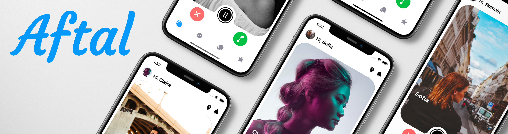

# Aftal : accordez-vous !

Want to learn a new instrument ? expand your musical network ? or just looking for people to enjoy with at that festival ?  
Discover like-minded people, share your favorites songs and instruments, like and be like and then chat with your differents matches. With a variety of different profiles, find the right person to pursue your musical project and contact them directly on the app through a build in chat section.
  
An iOS/Android app built with React-Native and Firebase. 

## Screenshots

  
  
  
  
  

