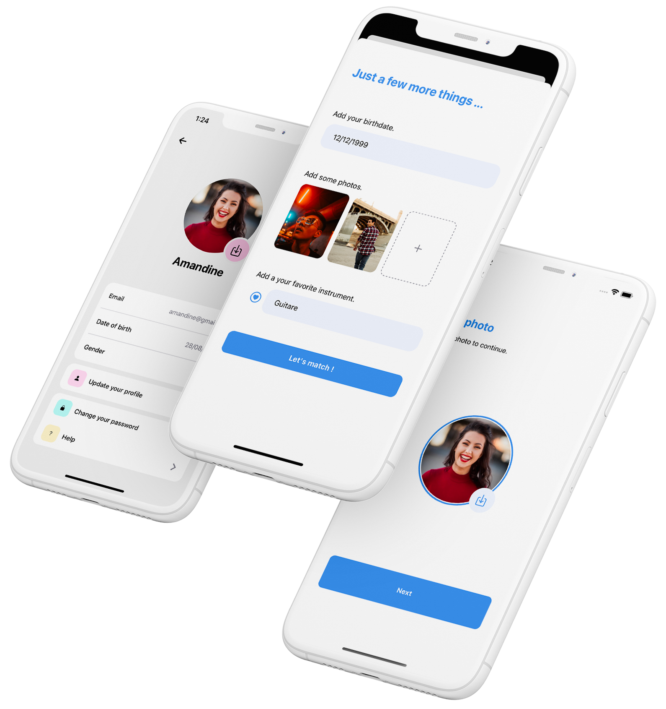

# Aftal : accordez-vous !

Want to learn a new instrument ? expand your musical network ? or just looking for people to enjoy with at that festival ?
  
Discover like-minded people, share your favorites songs and instruments, like and be like and then chat with your differents matches. With a variety of different profiles, find the right person to pursue your musical project and contact them directly on the app through a build in chat section.
  
An iOS/Android app built with React-Native and Firebase. 

 

## Walkthrough

> ### 0\. The Profile 🤓
> 
> 

New users who are not yet registered must create an account to use the app. A name, an age, a profile picture and some photos are required. The user can sign up by mail or Google, handled by **Firebase Authentification** and [**RNFirebase**](https://github.com/invertase/react-native-firebase).
  

> ### 1\. The Discovery ✨
> 
> 

Registered users are then able to swipe through the variety of profiles available on the app, the numbers of like is limited to preserve the app lifecycle. A custom card model and deck manager have been created from scratch.
  

> ### 2\. The Match 🔥
> 
> 

When two users like each other on the app, a match is triggered. They are now able to contact in the chat section by looking up in the recent matches row. All the datas are handled with **Firebase Firestore** and **Firebase Storage**. 
  

> ### 3\. The Chat 🫧
> 
> 
Users can chat in real time with the build in chat section of the app. The navigation through the differents part of the app is handled by [**React Navigation**](https://github.com/react-navigation/react-navigation) and the messages are stored on **Firebase Firestore**.
  

## Screenshots

  
  
  
  
  

