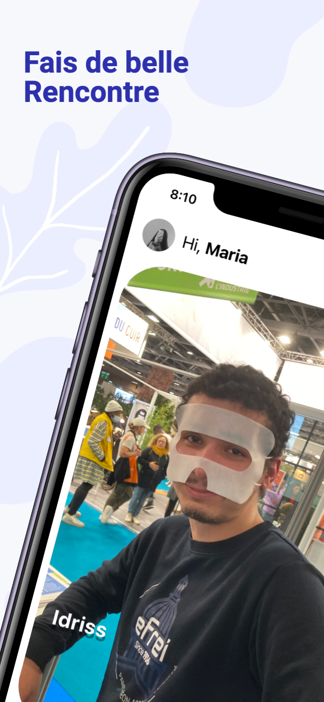

# Aftal : accordez-vous !

Want to learn a new instrument ? expand your musical network ? or just looking for people to enjoy that festival with ?
<br/><br/>
Discover like-minded people, share your favourite songs and instruments, like and be liked, and then chat with your different matches. With a variety of different profiles, find the right person to pursue your musical project and contact them directly on the app through a built-in chat section.
<br/><br/>
an iOS and Android app built with React Native and Firebase.
<br/>

<br/>

## Walkthrough

> ### 0\. The Profile 🤓
> 
> 

New users who are not yet registered must create an account to use the app. A name, an age, a profile picture, and some photos are required. The user can sign up by mail or Google, handled by **Firebase Authentification** and [**RNFirebase**](https://github.com/invertase/react-native-firebase).
<br/><br/>

> ### 1\. The Discovery ✨
> 
> 

Registered users are then able to swipe through the variety of profiles available on the app; the number of likes is limited to preserve the app's lifecycle. A custom card model and deck manager have been created from scratch.
<br/><br/>

> ### 2\. The Match 🔥
> 
> 

When two users like each other on the app, a match is triggered. They are now able to contact each other in the chat section by looking up in the recent matches row. All the data is handled by **Firebase Firestore** and **Firebase Storage**. 
<br/><br/>

> ### 3\. The Discussion 🫧
> 
> 
Users can chat in real time with the built-in chat section of the app. The navigation through the differents part of the app is handled by [**React Navigation**](https://github.com/react-navigation/react-navigation), and the messages are stored on **Firebase Firestore**.
<br/><br/>

## License
Aftal is licenced under the [MIT](https://github.com/lorematteo/aftal-app/blob/master/LICENSE.md).
```plaintext
MIT License

Copyright (c) 2023 Mattéo Lo Re

Permission is hereby granted, free of charge, to any person obtaining a copy
of this software and associated documentation files (the "Software"), to deal
in the Software without restriction, including without limitation the rights
to use, copy, modify, merge, publish, distribute, sublicense, and/or sell
copies of the Software, and to permit persons to whom the Software is
furnished to do so, subject to the following conditions:

The above copyright notice and this permission notice shall be included in all
copies or substantial portions of the Software.

THE SOFTWARE IS PROVIDED "AS IS", WITHOUT WARRANTY OF ANY KIND, EXPRESS OR
IMPLIED, INCLUDING BUT NOT LIMITED TO THE WARRANTIES OF MERCHANTABILITY,
FITNESS FOR A PARTICULAR PURPOSE AND NONINFRINGEMENT. IN NO EVENT SHALL THE
AUTHORS OR COPYRIGHT HOLDERS BE LIABLE FOR ANY CLAIM, DAMAGES OR OTHER
LIABILITY, WHETHER IN AN ACTION OF CONTRACT, TORT OR OTHERWISE, ARISING FROM,
OUT OF OR IN CONNECTION WITH THE SOFTWARE OR THE USE OR OTHER DEALINGS IN THE
SOFTWARE.
```

## Author
- [@lorematteo](https://www.github.com/lorematteo)
<br/><br/>

## Store screenshots
<div style="display:flex;" >
  
  
  
  
  
</div>

